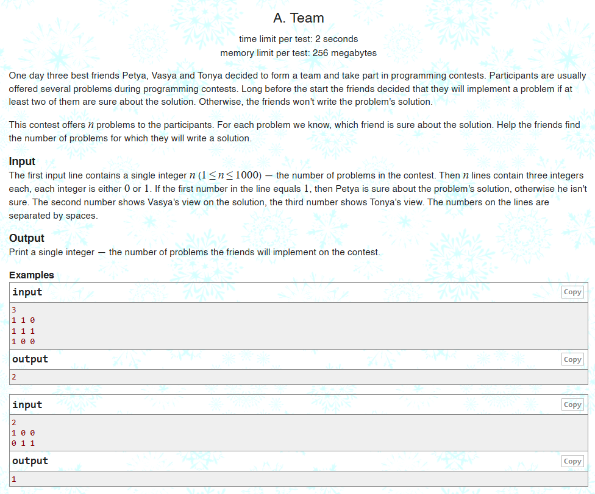

import Highlight from '@site/src/components/Highlight';

<Highlight>

¡Bienvenido al blog del Club de Algoritmia de CUCEI! 🎉 Este es un espacio diseñado para orientar a todos los interesados en entrar en el Club de Algoritmia de CUCEI, resolver preguntas frecuentes y darte una probadita de lo que es la ***programación competitiva***. ¿Estás listo?

</Highlight>

<!-- truncate -->

### **¿Quiénes somos?**

El **CAC (Club de Algoritmia de CUCEI)** es un grupo de apasionados por el problem solving y el trabajo en equipo. Un club de estudiantes para estudiantes (y algunos invitados) enfocado en enseñar y practicar temas de **programación competitiva**, con el objetivo de participar en concursos como el [**ICPC**](https://icpc.global/) (International Collegiate Programming Contest), uno de los torneos más prestigiosos del mundo en el área.

---

## **¿Para qué te puede servir participar en el CAC?**

### **Relación con materias universitarias**

El CAC no es una materia o curso que te certifique al final del semestre, no te suma horas de servicio, es una actividad extracurricular que por lo general no aporta directamente en tu papel como estudiante de la Universidad de Guadalajara.

### **Algunos beneficios**

<Highlight color="blue" emoji="🚀">
Dicho lo anterior, participar, estudiar y practicar lo visto en las sesiones del CAC es algo que te puede beneficiar bastante; existen algoritmos, estructuras de datos y otros temas que estudiamos en el CAC los cuales posteriormente puede que te parezcan familiares al cursar materias como Programación Orientada a Objetos, Estructuras de Datos o Análisis de Algoritmos.
</Highlight>

Además de ser un excelente entrenamiento para mejorar tus habilidades, la programación competitiva está respaldada por gigantes tecnológicos como **Google**, **Meta**, **Amazon**, **Oracle** y **Microsoft**, quienes no solo organizan competencias, sino que también buscan contratar a los talentos destacados.

Consulta más detalles en: [**Actividades y consejos de veteranos**](../2019-05-29-Actividad-y-Consejos.md).

---

### **¿Qué es la programación competitiva?**

<Highlight color="green" emoji="💻">
La mencionamos en el apartado anterior, mucha gente no la conoce pero la **programación competitiva** existe y es similar a un deporte, solo que con algoritmos y estructuras de datos.
</Highlight>

En particular, el ICPC es como un maratón de programación para equipos universitarios. Cada equipo, formado por tres estudiantes, recibe un conjunto de problemas (también llamado problemset) que **combinan programación, matemáticas y lógica**. Tienen un tiempo limitado, normalmente 5 horas, para resolver tantos problemas como les sea posible utilizando una sola computadora sin acceso a internet.

---

### **Ejemplo de un problema**

[**Problema A. Team**](https://codeforces.com/problemset/problem/231/A)  
Este es un problema sencillo que se puede solucionar de manera rápida con lógica y un par de bucles, es normal si hay muchas cosas que no entiendas, el mundo de la programación competitiva es un poco abrumador al principio, siempre habrán nuevas cosas por aprender pero poco a poco irás avanzando.

Consulta: [**Obteniendo mi primer Accepted**](../2019-05-29-Mi-primer-ac.md).

---

<Highlight color="purple" emoji="🌟">
Ojalá esta entrada del blog te haya convencido de seguir leyendo y de participar en el club de algoritmia, ¡Los esperamos!
</Highlight>
